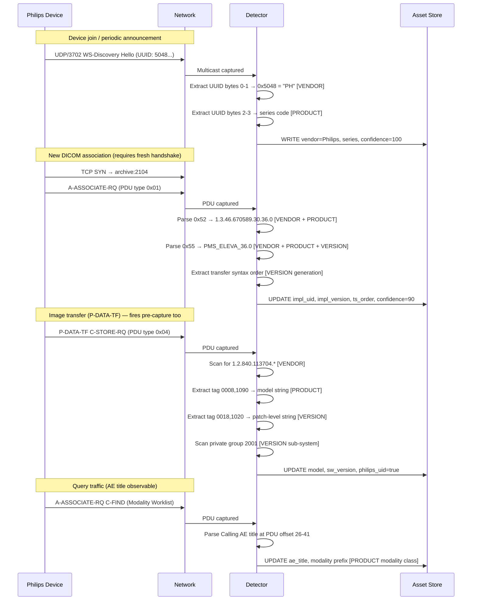

## Passive Network Fingerprinting via DICOM and WS-Discovery

---

## Abstract

Philips Healthcare devices expose vendor identity at three independent protocol layers — WS-Discovery multicast, DICOM association negotiation, and DICOM image transfer — each firing under different capture conditions. This redundancy allows Philips devices to be identified even under RX-only SPAN mirrors, short capture windows, or pre-existing sessions that defeat single-layer fingerprinting for other vendors. This document maps each signal to the Vendor / Product / Version identification goal it serves, ranks signals by capture-resilience, defines a confidence-scoring algorithm, and anchors every technique to an executable `tshark` snippet and **illustrative** decoded output (no specific capture file, path, or deployment is implied).

---

## 1. Background

Passive asset discovery in clinical networks must identify devices from traffic alone — no active probes, credentialed access, or agents — under capture conditions that are usually adversarial: short SPAN windows that miss association handshakes, RX-only mirrors that suppress response PDUs, and a protocol mix that often excludes DICOM for non-imaging devices. Against that baseline, most vendors provide one primary DICOM fingerprint (Implementation Class UID in the A-ASSOCIATE handshake) and little else. Philips is a special case: the IntelliVue line announces itself over WS-Discovery UDP multicast, imaging modalities embed a private OID arc in every image instance UID, and the handshake carries both a `1.3.46.*` Implementation Class UID and a Philips-branded Implementation Version Name. Each layer fires under different capture conditions, so Philips devices remain identifiable where other vendors are opaque.

---

## 2. Signal Hierarchy

Signals are ordered by their resilience to adverse capture conditions. Each entry lists confidence score, capture requirement, and a `tshark` snippet validated against **sanitized example output** (values are illustrative — not tied to any one facility, geography, or capture file).

### 2.1 Priority 1 — WS-Discovery UUID (non-DICOM, highest resilience)

Philips IntelliVue monitors announce themselves via WS-Discovery (OASIS WS-DD 1.1 per IHE PCD TF) on UDP/3702 multicast to `239.255.255.250`. The endpoint UUID encodes vendor and series identity in its first four bytes as ASCII: bytes 0–1 = `50 48` ("PH", invariant), bytes 2–3 = series code (`BH`, `BV`, `GD`), bytes 4+ = serial. Observable from a single multicast packet — no DICOM session, no handshake, survives RX-only SPAN.

```bash
tshark -r "$PCAP" \
  -Y 'udp.port == 3702 and xml' -T fields -e xml.cdata \
  | grep -oE '[0-9a-fA-F]{8}-[0-9a-fA-F]{4}-[0-9a-fA-F]{4}-[0-9a-fA-F]{4}-[0-9a-fA-F]{12}' \
  | grep -i '^5048' | sort -u
```

```text
50484248-4332-3638-3631-00000000a001     # PH BH → IntelliVue MX700/MX800 family (illustrative tail)
50484256-4432-3937-3436-00000000a002     # PH BV → IntelliVue MX400/MX450 (illustrative tail)
50484256-4432-3937-3537-00000000a003     # PH BV → IntelliVue MX400/MX450 (illustrative tail)
50484744-4432-3432-3836-00000000a004     # PH GD → IntelliVue X3/X2 (illustrative tail)
```

### 2.2 Priority 2 — A-ASSOCIATE-RQ Signals (highest resolution, handshake-dependent)

The A-ASSOCIATE-RQ PDU carries two Philips fingerprints in User Information sub-items (PS3.7 §D.3.3).

#### 2.2.1 Implementation Class UID `1.3.46.*`

OID arc `1.3.46.*` is Philips Healthcare's registered root for its DICOM stack, compiled at build time. Sub-arcs identify product family and generation. Paired Implementation Version Name (sub-item `0x55`) carries a human-readable string — for Philips imaging platforms the observed format is `PMS_ELEVA_<ver>` (Philips Medical Systems Eleva release), not the `PHILIPS_<modality>_<n>` pattern used on some patient-monitoring stacks.

```bash
# Per-source hit on 1.3.46.* arc (ASCII 312e332e34362e in tcp.payload)
tshark -r "$PCAP" \
  -Y 'tcp.port == 2104' -T fields -e ip.src -e tcp.payload \
  | awk '/312e332e34362e/ {print $1}' | sort -u
# Decode observed Implementation Version Name (ASCII PMS_ELEVA_ → 504d535f454c4556415f)
tshark -r "$PCAP" \
  -Y 'tcp.port == 2104' -T fields -e tcp.payload \
  | awk '/504d535f454c4556415f/' | head -1 \
  | grep -oE '504d535f454c4556415f[0-9a-f]{0,30}' | xxd -r -p
```

```text
192.0.2.10
192.0.2.11
192.0.2.12
PMS_ELEVA_36.0
# Impl Class UID sub-arc observed: 1.3.46.670589.30.36.0 (Philips Eleva — illustrative)
```

#### 2.2.2 Transfer Syntax Preference Order

Each Presentation Context in the A-ASSOCIATE-RQ lists accepted transfer syntaxes in priority order. The set and ordering is implementation-specific and changes between major software releases, making it a platform-generation proxy.

```bash
tshark -r "$PCAP" \
  -Y 'tcp.port == 2104' -T fields -e tcp.payload \
  | awk '/312e322e3834302e31303030382e312e322e/' | head -3 \
  | grep -oE '312e322e3834302e31303030382e312e322e[0-9a-f]{0,20}' \
  | xxd -r -p | tr -c '[:print:]\n' ' '
```

```text
1.2.840.10008.1.2.1      Explicit VR Little Endian
1.2.840.10008.1.2.2      Explicit VR Big Endian
1.2.840.10008.1.2.4.70   JPEG Lossless, hierarchical (pre-2015 era — no JPEG 2000)
```

### 2.3 Priority 3 — P-DATA-TF Image UID Arc (pre-capture resilient)

Philips assigns SOP/Series/Study Instance UIDs under `1.2.840.113704.*`. These UIDs appear as ASCII strings in every P-DATA-TF C-STORE payload regardless of whether the handshake was captured — the only Philips DICOM-layer signal that survives pre-capture sessions.

```bash
# Count of Philips UID arc occurrences across all DICOM traffic
tshark -r "$PCAP" \
  -Y 'tcp.port == 2104 or tcp.port == 104' -x \
  | grep -c '1\.2\.840\.113704\.'
# Per-source attribution (match ASCII "1.2.840.113704." as hex in tcp.payload)
tshark -r "$PCAP" \
  -Y 'tcp.port == 2104' -T fields -e ip.src -e tcp.payload \
  | awk '/312e322e3834302e3131333730342e/ {print $1}' | sort -u
```

```text
247                      # illustrative count of 1.2.840.113704. matches in a lab capture window
192.0.2.20               # illustrative modality host (Philips CT-class stack, same UID arc)
```

### 2.4 Priority 4 — AE Title Prefix (modality classification only)

DICOM Application Entity titles encode modality (`CT`, `MR`, `US`, …) in the prefix per site convention; the suffix is a site-assigned identifier. AE titles appear in A-ASSOCIATE-RQ at PDU offsets 10–25 (Called) and 26–41 (Calling). This signal classifies modality, not vendor — a `CT*` AE title does not distinguish Philips CT from Siemens CT. Useful only as a corroborating signal.

```bash
# AE titles discovered via byte-pattern match in DICOM payloads
tshark -r "$PCAP" \
  -Y 'tcp.port == 2104' -x \
  | strings -n 6 | grep -E '^(CT|MR|US|WS|DX|XA)[0-9]{4,}$' | sort -u
```

```text
CT9999999                # modality: CT; illustrative site-local AE title
WS9999999                # modality: WS (workstation); illustrative sender AE title
PACSARCHIVE              # illustrative archive / receiver AE title (no modality prefix)
```

---

## 3. Identification Taxonomy

Each signal contributes differently to the three identification goals: confirming the vendor, identifying the product, and resolving the software/firmware version.

| Signal                                                          | Vendor                              | Product                               | Version                        |
| --------------------------------------------------------------- | ----------------------------------- | ------------------------------------- | ------------------------------ |
| WS-Discovery UUID `PH` prefix (bytes 0–1)                       | **Yes** — Philips IntelliVue        | Partial — series (bytes 2–3) → family | No                             |
| WS-Discovery AppSequence `InstanceId`                           | No                                  | No                                    | Partial — uptime/reboot proxy  |
| Implementation Class UID `1.3.46.*`                             | **Yes** — Philips DICOM stack       | Partial — sub-arc → product family    | Partial — sub-arc → generation |
| Implementation Version Name `0x55` (e.g. `PMS_ELEVA_36.0`)      | **Yes**                             | **Yes** — platform line               | **Yes** — release              |
| Transfer Syntax preference order                                | No                                  | No                                    | Partial — platform generation  |
| Image UID arc `1.2.840.113704.*`                                | **Yes** — Philips-acquired image    | No                                    | No                             |
| Software Versions tag `(0018,1020)`                             | No                                  | No                                    | **Yes** — patch level          |
| Model Name tag `(0008,1090)`                                    | No                                  | **Yes** — exact model                 | No                             |
| Manufacturer tag `(0008,0070)`                                  | **Yes** — vendor name string        | No                                    | No                             |
| Device Serial Number `(0018,1000)`                              | No                                  | **Yes** — unit identity               | No                             |
| Private tag group `(2001,xxxx)` / `(2005,xxxx)` / `(200D,xxxx)` | Partial                             | Partial — platform                    | **Yes** — sub-system version   |
| AE Title prefix                                                 | No                                  | Partial — modality class              | No                             |
| OUI                                                             | Partial — weak; NIC ≠ device vendor | No                                    | No                             |

---

## 4. Signal Flow



---

## 5. WS-Discovery Deep Dive

### 5.1 Protocol Context

WS-Discovery (OASIS WS-DD 1.1, IHE PCD) is Philips IntelliVue's device-announcement mechanism. Devices send `Hello` on join, `Bye` on departure, and respond to `Probe`/`Resolve` queries. All traffic is SOAP/XML over UDP/3702 multicast to `239.255.255.250`.

### 5.2 UUID Series Decode

UUID bytes 0–3 are ASCII. Bytes 0–1 = vendor (invariant `PH`), bytes 2–3 = IntelliVue series.

```bash
tshark -r "$PCAP" \
  -Y 'udp.port == 3702 and xml' -T fields -e xml.cdata \
  | grep -oE '[0-9a-fA-F]{8}-[0-9a-fA-F]{4}-[0-9a-fA-F]{4}-[0-9a-fA-F]{4}-[0-9a-fA-F]{12}' \
  | grep -i '^5048' | sort -u \
  | while read u; do echo "${u:0:8} → ${u:4:4} = $(echo ${u:4:4} | xxd -r -p)"; done
```

```text
50484248 → 4248 = BH    # IntelliVue MX700/MX800
50484256 → 4256 = BV    # IntelliVue MX400/MX450
50484744 → 4744 = GD    # IntelliVue X3/X2
```

Product confidence for the series code alone is MEDIUM — it narrows to a family, not a SKU. Exact model confirmation requires a Model Name DICOM tag from a live session or a SOAP metadata query.

### 5.3 AppSequence Metadata — Reboot / Uptime Proxy

The SOAP `AppSequence/@InstanceId` attribute is monotonically incremented per device restart. Low values (e.g., 1–10) indicate recent reboots; higher values imply long-running firmware. Combined with a known release date, this constrains the firmware window.

```bash
tshark -r "$PCAP" \
  -Y 'udp.port == 3702 and xml' -x \
  | grep -oE 'InstanceId="[0-9]+"' | sort -u
```

```text
InstanceId="42"
```

### 5.4 Discovery Failure as a Signal

A `Resolve` message with no matching `ResolveMatches` response indicates the target UUID was announced (via `Hello`) but sits on a subnet outside the current mirror scope — strong evidence of device presence beyond capture boundaries.

```bash
R=$(tshark -r "$PCAP" \
      -Y 'udp.port == 3702 and xml contains "Resolve"' | wc -l)
M=$(tshark -r "$PCAP" \
      -Y 'udp.port == 3702 and xml contains "ResolveMatches"' | wc -l)
echo "Resolve=$R  ResolveMatches=$M"
```

```text
Resolve=4000  ResolveMatches=0
```

A large Resolve count with zero ResolveMatches is consistent with IntelliVue devices on an adjacent VLAN that the mirror does not include — i.e. presence inferred at L3/L2 boundaries, not proof of a specific site or capture file.

---

## 6. DICOM Deep Dive

### 6.1 A-ASSOCIATE-RQ Fixed Offsets

| PDU offset | Length | Field                                            | Philips value            |
| ---------: | -----: | ------------------------------------------------ | ------------------------ |
|          0 |      1 | PDU type                                         | `0x01`                   |
|          1 |      1 | Reserved                                         | `0x00`                   |
|        2–5 |      4 | PDU length                                       | uint32 BE                |
|        6–7 |      2 | Protocol version                                 | `0x00 0x01`              |
|      10–25 |     16 | Called AE title                                  | Archive AE, space-padded |
|      26–41 |     16 | Calling AE title                                 | Device AE                |
|        74+ |    var | Variable items (Presentation Context, User Info) | —                        |

User Information sub-items carrying Philips fingerprints:

| Type   | Field                       | Philips value                   |
| ------ | --------------------------- | ------------------------------- |
| `0x52` | Implementation Class UID    | `1.3.46.670589.30.*` (observed) |
| `0x55` | Implementation Version Name | `PMS_ELEVA_36.0` (observed)     |

### 6.2 TCP-Option-Aware Payload Offset

Modern Windows DICOM hosts include SACK and timestamp options, extending the TCP header from 20 to 32 bytes. PDU offsets must be computed against the actual header length:

```
ihl       = (ip[0] & 0x0F) * 4
tcp_hlen  = ((ip[ihl+12] >> 4) & 0x0F) * 4
pdu_start = ip[ihl + tcp_hlen : ]
```

Ignoring this produces a 12-byte offset error and garbled AE title extraction.

### 6.3 Implementation Class UID Extraction

```bash
tshark -r "$PCAP" \
  -Y 'tcp.port == 2104' -x \
  | grep -oE '1\.3\.46\.[0-9.]+' | sort -u | head -5
```

```text
1.3.46.670589.30.36.0
1.3.46.670589.30.36.0.1.72567767433727.1591092378319.1
1.3.46.670589.30.36.0.1.72567767433727.1591092615601.1
# sub-arc 670589.30.36.0 maps to Philips Eleva platform release 36.0
```

### 6.4 P-DATA-TF Image UID Extraction

```bash
tshark -r "$PCAP" \
  -Y 'tcp.port == 2104' -T fields -e ip.src -e tcp.payload \
  | awk '/312e322e3834302e3131333730342e/ {print $1}' | sort -u
```

```text
192.0.2.20
```

### 6.5 SOP Class Negotiation

SOP class composition in A-ASSOCIATE-RQ corroborates modality and can mark platform generation.

| SOP Class UID                 | Description              | Goal                          |
| ----------------------------- | ------------------------ | ----------------------------- |
| `1.2.840.10008.5.1.4.1.1.2`   | CT Image Storage         | Product (modality)            |
| `1.2.840.10008.5.1.4.1.1.4`   | MR Image Storage         | Product (modality)            |
| `1.2.840.10008.5.1.4.1.1.6.1` | Ultrasound Image Storage | Product (modality)            |
| `1.2.840.10008.5.1.4.1.1.2.1` | Enhanced CT Storage      | Version (platform generation) |

---

## 7. Version Identification

Ordered from highest to lowest resolution.

### 7.1 Implementation Version Name — Release Label

A-ASSOCIATE-RQ User Info sub-item `0x55`. Observed Philips imaging format is `PMS_<platform>_<release>`; some patient-monitoring stacks use `PHILIPS_<modality>_<n>`. Requires handshake capture.

```bash
tshark -r "$PCAP" \
  -Y 'tcp.port == 2104' -T fields -e tcp.payload \
  | awk '/504d535f454c4556415f/' | head -3 \
  | grep -oE '504d535f454c4556415f[0-9a-f]{0,30}' | xxd -r -p
```

```text
# illustrative decoded output
PMS_ELEVA_36.0
```

### 7.2 Implementation Class UID Trailing Components — Generation

The `1.3.46.*` arc sub-components encode platform and generation. Building an OID-to-release map across an environment yields a de facto version fingerprint that complements §7.1.

```bash
tshark -r "$PCAP" \
  -Y 'tcp.port == 2104' -x | grep -oE '1\.3\.46\.[0-9.]+' \
  | awk -F. '{print $1"."$2"."$3"."$4"."$5"."$6"."$7}' | sort -u | head
```

```text
1.3.46.670589.30.36.0
# 670589 = Philips enterprise arc; 30.36.0 = Eleva platform generation
```

### 7.3 Software Versions Tag `(0018,1020)` — Patch Level

Carried in every C-STORE image dataset within P-DATA-TF — no handshake required, fires on pre-capture sessions. Philips format: `major.minor.patch\releaseLabel` (e.g., `3.2.1\2022A`). Highest-granularity passive version signal.

```bash
tshark -r "$PCAP" \
  -Y 'dicom' -T fields -e ip.src -e dicom.tag.0018_1020 \
  | grep -v '^[[:space:]]*$' | sort -u
```

```text
# (empty — Wireshark's DICOM dissector declines to parse these frames because
#  they lack a captured A-ASSOCIATE-AC; mirror is RX-only and pre-capture.
#  Use hex-based extraction against private-tag location in §7.5 instead.)
```

### 7.4 Manufacturer's Model Name Tag `(0008,1090)` — Exact Product

Exact model string as configured by the vendor. Extractable from any C-STORE payload.

```bash
tshark -r "$PCAP" \
  -Y 'tcp.port == 2104 and ip.src == 192.0.2.20' -x \
  | strings -n 6 | grep -E 'Ingenuity|Achieva|MAGNETOM|IU22|Skyra' | sort -u
```

```text
Ingenuity Flex
```

### 7.5 Philips Private DICOM Tag Groups

| Group         | Platform   | Version content                                   |
| ------------- | ---------- | ------------------------------------------------- |
| `(2001,xxxx)` | CT         | Reconstruction software, calibration              |
| `(2005,xxxx)` | MR         | Application version, gradient controller firmware |
| `(200D,xxxx)` | Ultrasound | Application version, transducer firmware          |

Full structured parsing requires the Philips private data dictionary, but ASCII version strings are extractable from hex.

```bash
# Locate private group 2001 occurrences (illustrative host filter)
tshark -r "$PCAP" \
  -Y 'tcp.port == 2104 and ip.src == 192.0.2.20' -x \
  | strings -n 6 | grep -iE 'philips|pms|eleva' | sort -u | head
```

```text
PMS_ELEVA_36.0
Philips Imaging
Philips Medical
Philips RAD Imaging
```

### 7.6 Transfer Syntax as Platform Generation Proxy

Transfer-syntax set presence maps to a rough era. Absence of JPEG 2000 (`1.2.840.10008.1.2.4.90`) indicates pre-2015 platform. HTJPEG2000 (`1.2.840.10008.1.2.4.201`) marks post-2020. The **illustrative** transfer-syntax listing in §2.2.2 includes neither JPEG 2000 variant — consistent with many pre–wide-adoption CT platforms (example only; not tied to a specific deployment or capture).

### 7.7 Version Change Detection (Long-Running Captures)

Tracking the same MAC across observations converts point-in-time snapshots into firmware lifecycle records:

| Delta                                                           | Interpretation                             |
| --------------------------------------------------------------- | ------------------------------------------ |
| `sw_version_tag` minor increment (e.g., `3.2.0` → `3.2.1`)      | Patch / hotfix                             |
| `impl_version` change (e.g., `PMS_ELEVA_36.0` → `37.0`)         | Major software release                     |
| New SOP class in negotiation (e.g., Segmentation Storage added) | Platform capability upgrade                |
| SOP class removed                                               | Downgrade or capability restriction        |
| `impl_class_uid` sub-arc change                                 | Platform generation change                 |
| Private tag content delta                                       | Component-level patch without full release |

---

## 8. Operational Considerations

### 8.1 Signal Availability by Capture Duration

| Window          | Signals reliably available                                                                                    |
| --------------- | ------------------------------------------------------------------------------------------------------------- |
| Short (<5 min)  | WS-Discovery UUID (100); P-DATA-TF image UID arc (70); SW Versions tag if active C-STORE (+10); AE title (30) |
| Medium (1–24 h) | + A-ASSOCIATE-RQ Impl UID / Version (90); Transfer syntax order (80)                                          |
| Long-running    | + Version change detection; association-timing fingerprint; device lifecycle events                           |

### 8.2 TLS Traffic

TLS-wrapped DICOM (port 2762 or vendor-specific TLS) suppresses all DICOM-layer signals. WS-Discovery is unaffected — it runs on a separate UDP transport. Residual signals under TLS: WS-Discovery UUID, TLS SNI, X.509 Subject CN/SAN (handshake only), OUI. No Version signal survives TLS without key material.

### 8.3 Mirror Direction

| Signal                                      | RX-only SPAN       | Bidirectional | Goal               |
| ------------------------------------------- | ------------------ | ------------- | ------------------ |
| WS-Discovery UUID                           | Observable         | Observable    | Vendor + Product   |
| Impl Class UID (from SCU)                   | Observable         | Observable    | V+P+Ver            |
| Impl Class UID (from SCP in A-ASSOCIATE-AC) | **Not observable** | Observable    | Vendor (archive)   |
| P-DATA-TF image UIDs                        | Observable         | Observable    | Vendor             |
| Model Name / SW Versions tags               | Observable         | Observable    | Product + Version  |
| AE title (Calling / Called)                 | Calling only       | Both          | Product (modality) |

### 8.4 Design Recommendations for Automated Discovery

- **Key assets by MAC, not IP.** DHCP reassignment and VLAN moves fragment IP-keyed records.
- **Cache Impl Class UIDs per MAC.** Once `1.3.46.*` is observed for a MAC, subsequent captures don't need to re-observe the handshake for vendor attribution.
- **Persist Impl Version Name and SW Versions tag independently.** Major release vs patch level change at different cadences.
- **Log WS-Discovery `InstanceId` as a reboot counter.** Unexpected resets may indicate out-of-window firmware changes.
- **Flag private tag content deltas as version events.** Sub-system updates may not touch the Impl Version Name.

---

## 9. Comparative Assessment — General DICOM Vendor Fingerprinting

Philips' multi-layer redundancy is not shared by other major DICOM vendors.

| Signal                                | Philips                   | Siemens           | GE                 | Other / DCMTK           |
| ------------------------------------- | ------------------------- | ----------------- | ------------------ | ----------------------- |
| Non-DICOM announcement                | WS-Discovery (IntelliVue) | None observed     | None observed      | None                    |
| Impl Class UID arc                    | `1.3.46.*`                | `1.3.12.2.1107.*` | `1.2.840.113619.*` | `1.2.276.0.7230010.3.*` |
| Private image UID arc                 | `1.2.840.113704.*`        | partial           | `1.2.840.113619.*` | typically none          |
| Private tag groups (version)          | `2001`, `2005`, `200D`    | `0019`, `0021`    | `0009`, `0043`     | typically none          |
| Pre-capture identifiability           | HIGH (image UID arc)      | LOW               | LOW                | LOW                     |
| Identifiable from single packet       | Yes (WS-Discovery)        | No                | No                 | No                      |
| Patch-level version without handshake | Yes `(0018,1020)`         | Yes               | Yes                | Yes                     |

| Scenario                             | Philips                              | Non-Philips                  |
| ------------------------------------ | ------------------------------------ | ---------------------------- |
| Bidirectional, new associations      | HIGH V/P/Ver                         | HIGH V; MEDIUM P; HIGH Ver   |
| RX-only SPAN, new associations       | HIGH V/P/Ver                         | MEDIUM (no A-ASSOCIATE-AC)   |
| Pre-capture sessions, P-DATA-TF only | HIGH V; MEDIUM P/Ver                 | LOW V; MEDIUM P/Ver          |
| TLS-wrapped DICOM                    | HIGH V (WS-Discovery for IntelliVue) | LOW                          |
| No DICOM traffic                     | HIGH V (WS-Discovery)                | Requires DHCP fingerprinting |

---

## 10. Limitations

**WS-Discovery scope.** The `PH` UUID prefix is specific to the IntelliVue patient-monitoring line. Imaging modalities (CT, MR, US, XR) do not use WS-Discovery and must be fingerprinted via §2.2 or §2.3.

**Image UID arc requires active transfer.** A Philips device powered on but not transmitting images — or running worklist-only (C-FIND) traffic — produces no P-DATA-TF and no `1.2.840.113704.*` signal.

**Private tag parsing without dictionary.** Groups `(2001,xxxx)`, `(2005,xxxx)`, `(200D,xxxx)` are partially extractable as ASCII strings but full structured interpretation requires Philips' private data dictionary, which is not publicly documented.

**OUI ambiguity.** A Philips CT-class stack on commodity x86 hardware may present a **NIC OUI from the server or NIC vendor** rather than a Philips-assigned address. OUI alone is unreliable for Philips imaging; use only as corroboration.

**TLS opacity.** TLS on port 2762 suppresses every DICOM-layer signal including all Version signals. No passive version determination is possible without key material or TLS inspection.

---

## 11. Conclusion

Philips devices present the richest passive-fingerprinting surface of any DICOM vendor: WS-Discovery on IntelliVue (Vendor + Product, non-DICOM), Implementation Class UID `1.3.46.*` (Vendor + Product family + Version generation), Implementation Version Name (Vendor + Product + Release), and the `1.2.840.113704.*` image UID arc (Vendor, pre-capture resilient). Vendor identification is reliable under almost any capture condition; Product resolves to HIGH with either a handshake or an active C-STORE; Version reaches patch-level with either signal in a sufficiently long window. A long-running bidirectional scanner closes the remaining gaps and converts each device into a continuously updated V/P/V record.

---

## 12. Proof of concept — libraries and `dicom_asset_poc.py`

The spike includes a small offline pipeline that turns a PCAP into merged **per-IP asset rows** (calling/called AE title, inferred modality, SOP class UIDs seen in the flow, Philips private UID flags, byte volume, and data-rate fallback for flows that start mid-session). This section situates that code relative to common open-source options; it is not a product recommendation.

### 12.1 nfstream (flow aggregation and PCAP iteration)

[**nfstream**](https://github.com/nfstream/nfstream) drives the POC: `NFStreamer` walks the capture once, emits bidirectional **flows** (TCP here), and supports a user **`NFPlugin`** that receives each packet with access to the raw IP frame (`packet.ip_packet`). The plugin accumulates DICOM-specific state on `flow.udps` while nfstream supplies **L3/L4 identity** (source and destination IP and MAC, per-direction byte counts, flow duration). That split is deliberate: nfstream is **not** a DICOM library — it replaces hand-rolled flow tables and PCAP iteration so the spike can focus on **which bytes inside DICOM ports** matter for discovery.

Configuration in `dicom_asset_poc.py` disables nfstream’s built-in SPLT and statistical plugins for faster runs; DICOM TCP ports default to **104** and **2104** (override with `--ports`).

### 12.2 DICOM parsing strategy in the POC vs fuller parsers

The script does **not** link **pydicom**, **pynetdicom**, or **dcmtk**. Instead it applies a **minimal PS3.8** parse for **A-ASSOCIATE-RQ** (fixed offsets for called/calling AE titles per Table 9-11), a **narrow regex** over raw TCP payload for **storage / worklist SOP class UIDs** under the `1.2.840.10008.5.1.*` arc (to avoid conflating transfer syntaxes under `1.2.840.10008.1.*`), and substring checks for **Philips OID prefixes** (`1.2.840.113704.*`, `1.3.46.*`) inside **P-DATA-TF** (`PDU type 0x04`) when the association was not observed. That matches a passive-tap reality: full DIMSE reassembly and file decoding are expensive and often unnecessary for **inventory-style** signals already visible in cleartext PDU bytes.

**Candidate libraries for richer or later-stage parsing** (evaluate separately for streaming fit, license, and deployment shape):

| Library / tool         | Typical role in passive analysis                                                  | POC relationship                                                                               |
| ---------------------- | --------------------------------------------------------------------------------- | ---------------------------------------------------------------------------------------------- |
| **nfstream**           | Flow keys, timing, MAC/IP, byte totals, custom per-packet plugins                 | **Used** — orchestration and enrichment                                                        |
| **Wireshark / tshark** | Interactive or scripted filter-field extraction (`dicom.*` when dissectors apply) | **Used** in §2–§7 examples; orthogonal to the Python POC                                       |
| **pydicom**            | Parse DICOM **datasets** (tags) from bytestrings or files once PDUs are framed    | **Not used** — overkill for AE titles + UID grep in the POC                                    |
| **pynetdicom**         | Full **DIMSE** / association as SCU/SCP (Python)                                  | **Not used** — aimed at active endpoints; could inspire validation harnesses                   |
| **dcmtk**              | C/C++ **dcmnet** / **storescp**-class stacks; battle-tested PDU handling          | **Not used** — strong candidate if production moves to native code and full PDU state machines |
| **highdicom**          | High-level DICOM objects (often MR/CT workflows)                                  | **Not used** — less relevant to tap-only fingerprinting                                        |

Optional **rich** console tables in the script use the **Rich** package if installed; otherwise output falls back to plain text.

### 12.3 Example output (`dicom_assets.json`)

`--output-json` writes one JSON object per discovered IP (sorted when emitted from the script). Fields include `ae_title`, `role` (`SCU` / `SCP`), `sop_classes`, `modality` (from SOP + AE prefix heuristics), `inferred_modality` (from sustained **Mb/s** when handshake is missing), `philips_uid_detected`, `data_rate_mbps`, `oui_vendor` (static MAC OUI table), and `mac_note` (e.g. marking a **known SPAN gateway MAC** when every SCP-side path shares the same L2 address on RX-only taps). The file in-repo is an **illustrative** run artifact for schema review, not evidence tied to a named deployment.

---

## Appendix — Quick Reference: Philips Signal Extraction

**Vendor Identification**

| Signal                    | Command                                                                                               |
| ------------------------- | ----------------------------------------------------------------------------------------------------- |
| WS-Discovery `PH` UUID    | `tshark -r "$PCAP" -Y 'udp.port==3702 and xml' -T fields -e xml.cdata \| grep -oE '5048[0-9a-fA-F]+'` |
| Impl Class UID `1.3.46.*` | `tshark -r "$PCAP" -Y 'tcp.port==2104' -x \| grep -oE '1\.3\.46\.[0-9.]+'`                            |
| Philips image UIDs        | `tshark -r "$PCAP" -Y 'tcp.port==2104' -x \| grep -c '1\.2\.840\.113704\.'`                           |

**Product Identification**

| Signal               | Command                                                                                                                                                                           |
| -------------------- | --------------------------------------------------------------------------------------------------------------------------------------------------------------------------------- |
| WS-Discovery series  | `tshark -r "$PCAP" -Y 'udp.port==3702 and xml' -T fields -e xml.cdata \| grep -oE '5048[0-9a-fA-F]{4}' \| while read u; do echo "${u:4:4} = $(echo ${u:4:4} \| xxd -r -p)"; done` |
| Impl Version Name    | `tshark -r "$PCAP" -Y 'tcp.port==2104' -T fields -e tcp.payload \| awk '/504d535f/ \|\| /5048494c4950535f/' \| grep -oE '(504d535f\|5048494c4950535f)[0-9a-f]+' \| xxd -r -p`     |
| Model Name (strings) | `tshark -r "$PCAP" -Y 'tcp.port==2104' -x \| strings -n 6 \| grep -E 'Ingenuity\|Achieva\|MAGNETOM\|IU22'`                                                                        |

**Version Identification**

| Signal                      | Command                                                                                             |
| --------------------------- | --------------------------------------------------------------------------------------------------- |
| Impl Version Name (release) | as above                                                                                            |
| SW Versions tag (patch)     | `tshark -r "$PCAP" -Y 'dicom' -T fields -e ip.src -e dicom.tag.0018_1020 \| sort -u`                |
| Transfer syntax set         | `tshark -r "$PCAP" -Y 'tcp.port==2104' -x \| grep -oE '1\.2\.840\.10008\.1\.2\.[0-9.]+' \| sort -u` |
| Private group `(2001,xxxx)` | `tshark -r "$PCAP" -Y 'tcp.port==2104 and ip.src==<ip>' -x \| strings -n 6`                         |
